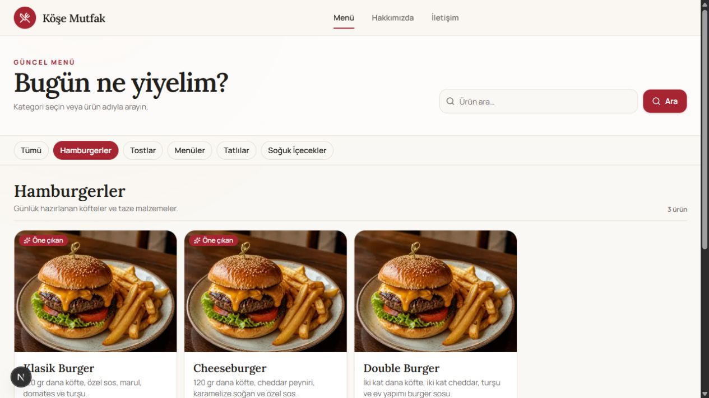
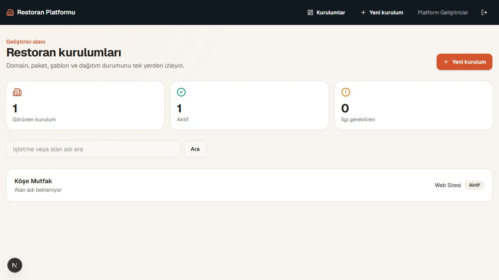
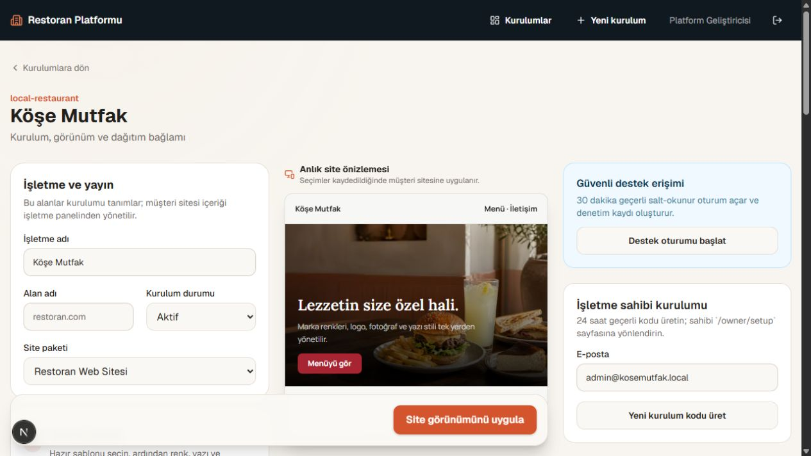

# Restaurant QR Menu Platform

Restoranlar için web sitesi, kalıcı QR menü ve yönetim panelleri sunan açık kaynaklı bir Next.js uygulaması. **Köşe Mutfak** projedeki örnek restorandır; menü, marka ve site içeriği yönetim ekranlarından değiştirilebilir.

Uygulama üç alandan oluşur:

| Alan | Ne işe yarar? |
| --- | --- |
| Müşteri sitesi | Restoranı, çalışma saatlerini, kategorileri ve güncel menüyü gösterir. |
| İşletme paneli | Ürünleri, fiyatları, mevcudiyeti ve site içeriğini yönetir. |
| Geliştirici paneli | Restoran kurulumunun temasını, marka ayarlarını ve görünür bölümlerini düzenler. |

QR kodu sabit `/menu` adresine yönlenir; menü değiştiğinde kodun yeniden basılması gerekmez. İşletme ve geliştirici hesaplarının girişleri ve yetkileri ayrıdır.

## Ekran görüntüleri

| Müşteri sitesi | Menü |
| --- | --- |
|  |  |

| İşletme paneli | Ürün yönetimi |
| --- | --- |
|  |  |

| Geliştirici paneli | Marka ayarları |
| --- | --- |
|  |  |

## Özellikler

- Kategorili menü, ürün sayfaları, çalışma saatleri ve iletişim sayfaları
- Ürün, fiyat, mevcudiyet ve işletme içeriği yönetimi
- İşletme için `OWNER` ve `EDITOR` rolleri
- Tema, renk, font, logo ve kapak görseli ayarları
- PNG/SVG olarak indirilebilen kalıcı QR kodu
- Sunucu tarafında doğrulama ve yetki kontrolleri

Her restoran ayrı uygulama kurulumu ve veritabanıyla çalışacak şekilde tasarlanmıştır. Geliştirici panelindeki yerel örnek kurulumu özelleştirmek mevcut uygulamada çalışır; farklı kurulumlara uzaktan otomatik dağıtım bu repository’de tamamlanmış bir özellik değildir.

## Teknolojiler

Next.js 16 · React 19 · TypeScript · Tailwind CSS · PostgreSQL · Prisma 7 · Better Auth · Cloudinary · Zod · Vitest · Playwright

## Yerel kurulum

Node.js, npm ve PostgreSQL gerekir. Önce [`.env.example`](.env.example) dosyasını `.env` olarak kopyalayın; veritabanı bağlantısını, oturum anahtarlarını ve ilk kullanıcı bilgilerini kendi ortamınıza göre düzenleyin. Görsel yüklemek için Cloudinary değişkenlerini de doldurun.

```bash
npm install
cp .env.example .env
npm run db:dev
npm run db:deploy
npm run db:seed
npm run dev
```

Windows Komut İstemi'nde `cp` yerine `copy` kullanın. Proje yerel PostgreSQL sunucunuzla çalışıyorsa `npm run db:dev` adımı gerekli değildir; `DATABASE_URL` değerini mevcut sunucunuza yönlendirin.

- Müşteri sitesi: [localhost:3000](http://localhost:3000)
- İşletme girişi: [localhost:3000/admin/login](http://localhost:3000/admin/login)
- Geliştirici girişi: [localhost:3000/platform/login](http://localhost:3000/platform/login)

İlk giriş hesapları `.env` dosyasındaki bootstrap bilgileriyle seed sırasında oluşturulur. Gerçek kurulumda güçlü parolalar kullanın ve bootstrap parola değişkenlerini seed sonrasında kaldırın.

## Kontroller

```bash
npm run typecheck
npm run lint
npm test
npm run build
npm run test:e2e
```

Veri modeli ve panellerin ilişkisi için [ürün mimarisi](docs/PRODUCT_ARCHITECTURE.md), yapılandırma için [ortam değişkenleri](.env.example) ve [Prisma şeması](prisma/schema.prisma) incelenebilir.

## Lisans

[MIT](LICENSE).
