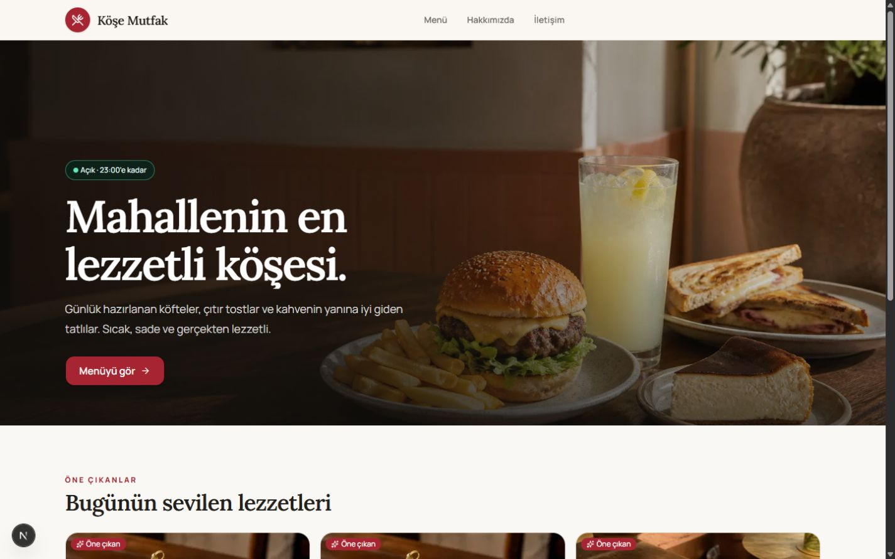
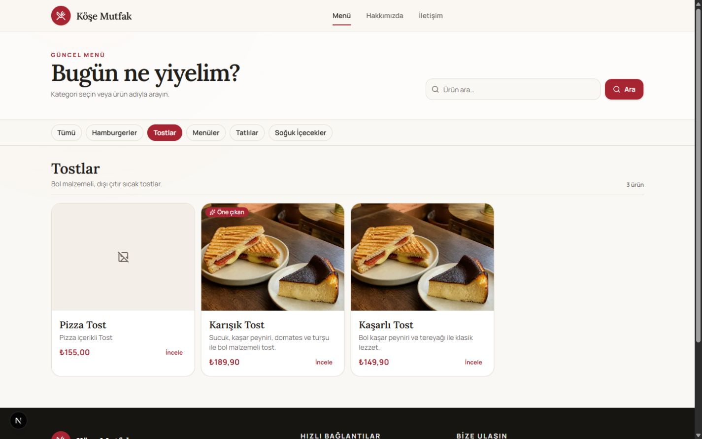
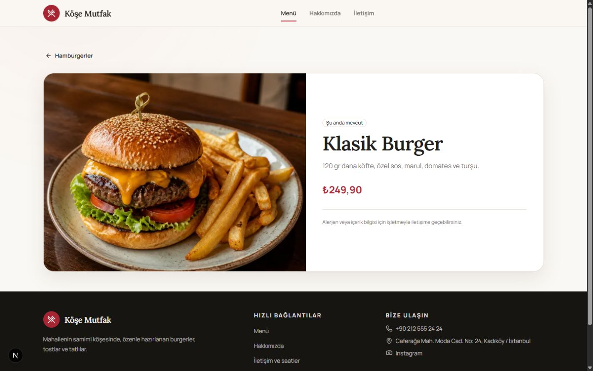
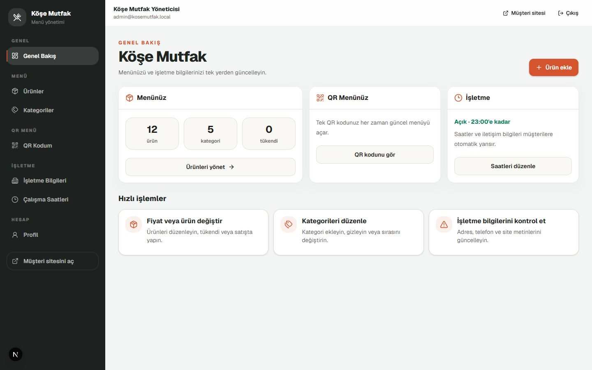
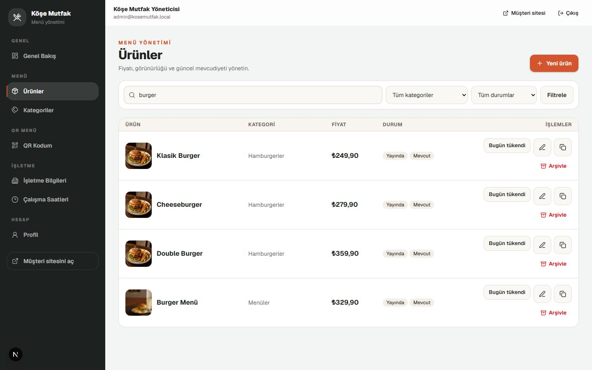

# Restoran Web Sitesi + Kalıcı QR Menü

Tek restoran için ayrı Vercel projesi, PostgreSQL veritabanı, Cloudinary hesabı ve domain ile kurulabilen yönetilebilir web sitesi şablonudur. “Köşe Mutfak” yalnız demo içeriğidir.

## Ekran görüntüleri

### Müşteri sitesi

| Ana sayfa | Dijital menü |
| --- | --- |
|  |  |



### İşletme yönetimi

| Genel bakış | Ürünler |
| --- | --- |
|  |  |

## Ürün kapsamı

- Public ana sayfa, menü, ürün detayı, hakkımızda ve iletişim sayfaları
- Değişmeyen `/menu` hedefli PNG/SVG QR kodu
- Kategori, ürün, mevcudiyet, çalışma saati, işletme içeriği ve profil yönetimi
- `OWNER` ve içerik odaklı `EDITOR` rolleri
- Restoran girişinden tamamen ayrı `/platform` geliştirici alanı
- Sıcak, modern ve klasik site şablonları; Manrope/Lora yazı stili; renk, logo, kapak, odak ve canlı önizleme

Checkout, PayTR, masa siparişi, mutfak ekranı, servis, kurye ve satış raporu bu ürünün parçası değildir; ilgili kaynak kod, rota, ortam sözleşmesi ve güncel veritabanı tabloları kaldırılmıştır.

## Teknoloji

Next.js 16 App Router, React 19, strict TypeScript, Tailwind CSS, PostgreSQL, Prisma 7, Better Auth, Cloudinary, Zod, Vitest ve Playwright.

## Proje düzeni

```text
src/app/          Sayfalar, layout'lar ve Route Handler'lar
src/components/   Public, admin, platform ve ortak UI bileşenleri
src/features/     İş kurallarını çalıştıran Server Action'lar
src/server/       Veritabanı, auth, güvenlik, medya ve DAL
src/platform/     Geliştirici paneli servisleri
src/validations/  Paylaşılan Zod sözleşmeleri
prisma/           Şema, ileri migration'lar, seed ve bakım komutu
tests/            Unit, integration ve E2E testleri
docs/             Mimari notlar ve güncel ekran görüntüleri
```

Derleme çıktıları, yerel veritabanı araçları, test raporları, loglar, environment dosyaları ve üretilen Prisma istemcisi Git'e dahil edilmez.

## Yerel kurulum

```bash
npm install
copy .env.example .env
npm run db:dev
npm run db:deploy
npm run db:seed
npm run dev
```

- Müşteri sitesi: `http://localhost:3000`
- İşletme paneli: `http://localhost:3000/admin/login`
- Geliştirici paneli: `http://localhost:3000/platform/login`

Bootstrap parolaları yalnız ilk seed için kullanılmalı ve production kurulumundan sonra environment’tan kaldırılmalıdır.

## Geliştirici özelleştirmesi

`/platform/instances/[id]` ekranında şablon, font, marka renkleri, logo, hazır/kendi kapak görseli, dokuz noktalı görsel odağı, paket ve görünür sayfalar seçilir. Seed’in oluşturduğu `deploymentProjectId=local` kaydı kaydedildiğinde seçimler aynı transaction içinde `RestaurantSettings` kaydına aktarılır; public cache yenilenir ve müşteri sitesi anında değişir.

Diğer müşteri kurulumları ayrı deployment ve veritabanı kullanır. Merkezi platformda secret veya müşteri verisi tutulmaz; uzaktaki deployment’a otomatik yayın için ileride imzalı bir yönetim endpoint’i kullanılmalıdır.

## Veritabanı ilkeleri

- Menü fiyatları `DECIMAL(10,2)`; kategori ilişkisi `RESTRICT`.
- Silme kullanıcı arayüzünde arşivleme şeklindedir; yanlış işlemler geri kazanılabilir.
- Slug’lar tekildir; public liste sorguları aktiflik, arşiv ve sıra bileşik indekslerini kullanır.
- Her mutation sunucuda tekrar Zod, session ve permission kontrolünden geçer.
- Migration geçmişi değiştirilmez; kaldırılan özellikler yeni bir ileri migration ile temizlenmiştir.

Production öncesinde:

```bash
pg_dump --format=custom --no-owner --file=restaurant-before-migration.dump "$DATABASE_URL"
npm run db:deploy
npm run db:seed
```

## Güvenlik

- Public kayıt kapalı; HTTP-only, secure-production ve same-site session cookie’leri
- Admin/platform için `private, no-store`; platform ve owner sayfalarında `noindex`
- Platform ve restoran kullanıcı/session tabloları ayrı
- Server Action ve Route Handler seviyesinde tekrar yetkilendirme
- Görsel MIME + dosya imzası kontrolü, 4 MB sınırı, server-side Cloudinary secret
- CSP, HSTS-production, `nosniff`, frame engeli, referrer ve permissions policy
- Giriş hız sınırı, hash’li platform tokenları ve sanitize audit kayıtları

`npm audit --omit=dev` şu anda Prisma’nın dolaylı `deepmerge-ts` bağımlılığı için upstream “no fix available” uyarısı vermektedir. Uygulama kullanıcı girdisini bu yapılandırma birleştiricisine iletmez; yine de Prisma yayınları düzenli izlenip düzeltme çıktığında güncellenmelidir.

## Kalite kapıları

```bash
npm run typecheck
npm run lint
npm test
npm run build
npm run test:e2e
```

Her teslimde gerçek domain/HTTPS, Cloudinary yükleme, QR baskı ve yönlendirme, 375 px mobil görünüm, klavye/focus, yedek alma ve geri yükleme ayrıca doğrulanmalıdır.

## Ayrıntılı dokümantasyon

- [Ürün mimarisi](docs/PRODUCT_ARCHITECTURE.md)
- [Environment örneği](.env.example)
- [Veritabanı şeması](prisma/schema.prisma)

## Lisans

Bu proje [MIT Lisansı](LICENSE) ile yayımlanmıştır.